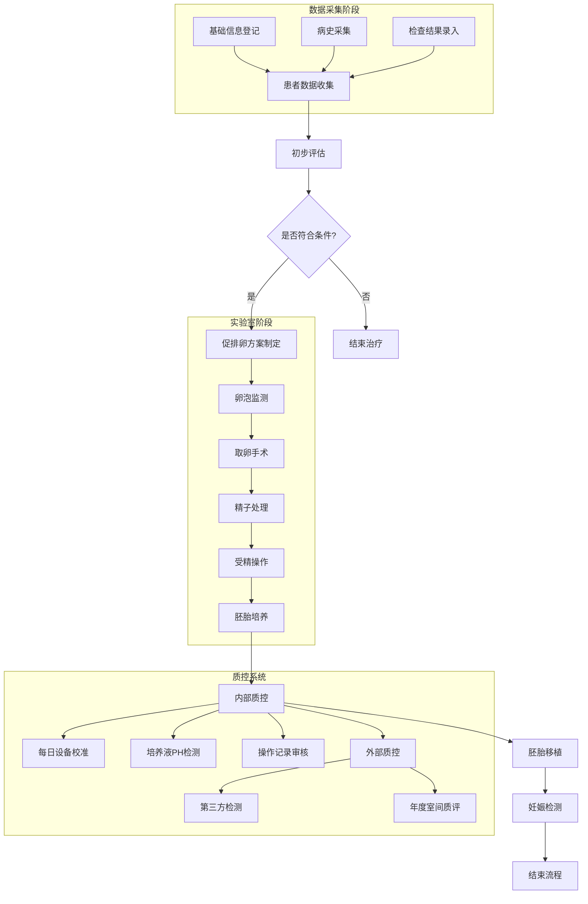

```mermaid
graph TD
    A[患者数据收集] --> B[初步评估]
    subgraph 数据采集阶段
        A1[基础信息登记] --> A
        A2[病史采集] --> A
        A3[检查结果录入] --> A
    end
    
    B --> C{是否符合条件?}
    C -->|是| D[促排卵方案制定]
    C -->|否| E[结束治疗]
    
    subgraph 实验室阶段
        D --> F[卵泡监测]
        F --> G[取卵手术]
        G --> H[精子处理]
        H --> I[受精操作]
        I --> J[胚胎培养]
    end
    
    subgraph 质控系统
        J --> K[内部质控]
        K --> K1[每日设备校准]
        K --> K2[培养液PH检测]
        K --> K3[操作记录审核]
        
        K --> L[外部质控]
        L --> L1[第三方检测]
        L --> L2[年度室间质评]
    end
    
    K --> M[胚胎移植]
    M --> N[妊娠检测]
    N --> O[结束流程]

```