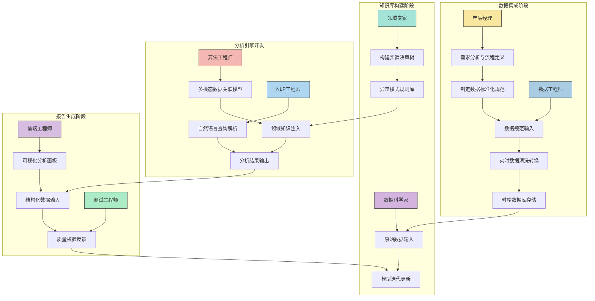

```mermaid
graph TD
    subgraph 数据集成阶段
        A1[产品经理] --> A2[需求分析与流程定义]
        A2 --> A3[制定数据标准化规范]
        B1[数据工程师] --> B2[佰能设备API对接]
        B2 --> B3[实时数据清洗转换]
        B3 --> B4[时序数据库存储]
    end

    subgraph 知识库构建阶段
        C1[数据科学家] --> C2[实验方案知识图谱建模]
        C2 --> C3[DeepSeek微调训练]
        D1[领域专家] --> D2[构建实验决策树]
        D2 --> D3[异常模式规则库]
    end

    subgraph 分析引擎开发
        E1[算法工程师] --> E2[多模态数据关联模型]
        E2 --> E3[实验参数智能匹配]
        F1[NLP工程师] --> F2[自然语言查询解析]
        F2 --> F3[动态数据分析管道]
    end

    subgraph 报告生成阶段
        G1[前端工程师] --> G2[可视化分析面板]
        G2 --> G3[自动化报告生成器]
        H1[测试工程师] --> H2[数据溯源验证]
    end

    A3 --> B2[数据规范输入]
    B4 --> C2[原始数据输入]
    D3 --> E3[领域知识注入]
    E3 --> F3[分析结果输出]
    F3 --> G3[结构化数据输入]
    G3 --> H2[质量校验反馈]
    H2 --> C3[模型迭代更新]

    style A1 fill:#F9E79F,stroke:#333
    style B1 fill:#A9CCE3,stroke:#333
    style C1 fill:#D2B4DE,stroke:#333
    style D1 fill:#A3E4D7,stroke:#333
    style E1 fill:#F5B7B1,stroke:#333
    style F1 fill:#AED6F1,stroke:#333
    style G1 fill:#D7BDE2,stroke:#333
    style H1 fill:#ABEBC6,stroke:#333

```