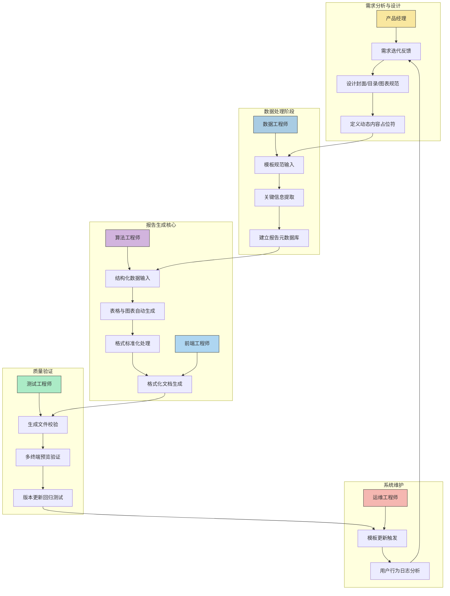

```mermaid
graph TD
    subgraph 需求分析与设计
        PM[产品经理] --> A1[报告模板需求分析]
        A1 --> A2[设计封面/目录/图表规范]
        A2 --> A3[定义动态内容占位符]
    end

    subgraph 数据处理阶段
        DE[数据工程师] --> B1[对话记录结构化存储]
        B1 --> B2[关键信息提取]
        B2 --> B3[建立报告元数据库]
    end

    subgraph 报告生成核心
        AE[算法工程师] --> C1[动态内容填充引擎]
        C1 --> C2[表格与图表自动生成]
        C2 --> C3[格式标准化处理]
        FE[前端工程师] --> C4[导出功能接口开发]
    end

    subgraph 质量验证
        QA[测试工程师] --> D1[格式兼容性测试]
        D1 --> D2[多终端预览验证]
        D2 --> D3[版本更新回归测试]
    end

    subgraph 系统维护
        OPS[运维工程师] --> E1[模板版本管理]
        E1 --> E2[用户行为日志分析]
    end

    A3 --> B1[模板规范输入]
    B3 --> C1[结构化数据输入]
    C3 --> C4[格式化文档生成]
    C4 --> D1[生成文件校验]
    D3 --> E1[模板更新触发]
    E2 --> A1[需求迭代反馈]

    style PM fill:#F9E79F,stroke:#333
    style DE fill:#A9CCE3,stroke:#333
    style AE fill:#D2B4DE,stroke:#333
    style FE fill:#AED6F1,stroke:#333
    style QA fill:#ABEBC6,stroke:#333
    style OPS fill:#F5B7B1,stroke:#333

```