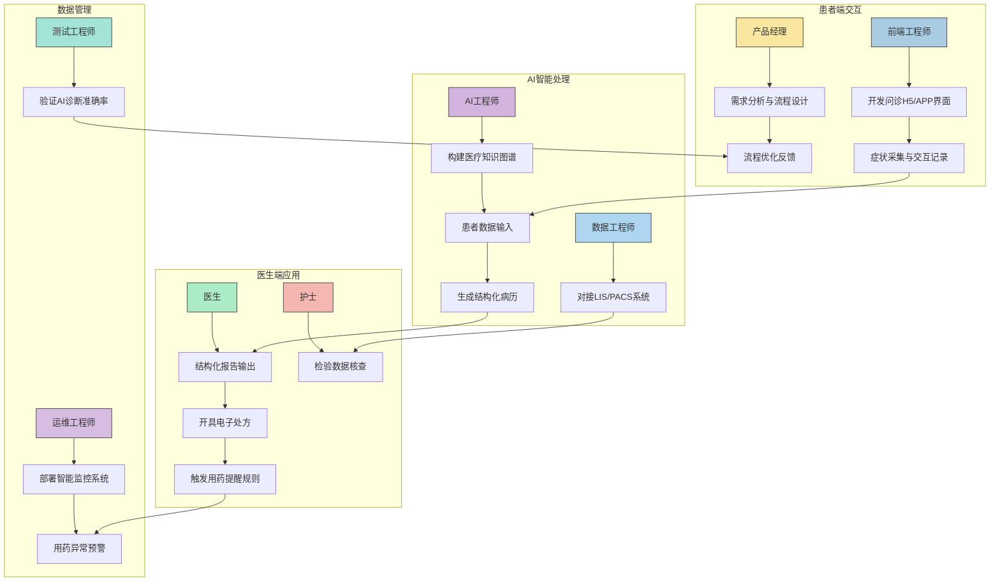

```mermaid
graph TD
    subgraph 患者端交互
        PM[产品经理] --> A1[需求分析与流程设计]
        A1 --> A2[设计智能问诊对话流]
        FE[前端工程师] --> A3[开发问诊H5/APP界面]
        A3 --> A4[症状采集与交互记录]
    end

    subgraph AI智能处理
        AE[AI工程师] --> B1[构建医疗知识图谱]
        B1 --> B2[DeepSeek模型微调]
        B2 --> B3[生成结构化病历]
        DE[数据工程师] --> B4[对接LIS/PACS系统]
    end

    subgraph 医生端应用
        DOC[医生] --> C1[查看AI预诊断报告]
        C1 --> C2[开具电子处方]
        C2 --> C3[触发用药提醒规则]
        NUR[护士] --> C4[接收验单质控提醒]
    end

    subgraph 数据管理
        OPS[运维工程师] --> D1[部署智能监控系统]
        D1 --> D2[异常预警分发]
        QA[测试工程师] --> D3[验证AI诊断准确率]
    end

    A4 --> B2[患者数据输入]
    B3 --> C1[结构化报告输出]
    C3 --> D2[用药异常预警]
    B4 --> C4[检验数据核查]
    D3 --> A2[流程优化反馈]

    style PM fill:#F9E79F,stroke:#333
    style FE fill:#A9CCE3,stroke:#333
    style AE fill:#D2B4DE,stroke:#333
    style DE fill:#AED6F1,stroke:#333
    style DOC fill:#ABEBC6,stroke:#333
    style NUR fill:#F5B7B1,stroke:#333
    style OPS fill:#D7BDE2,stroke:#333
    style QA fill:#A3E4D7,stroke:#333

```