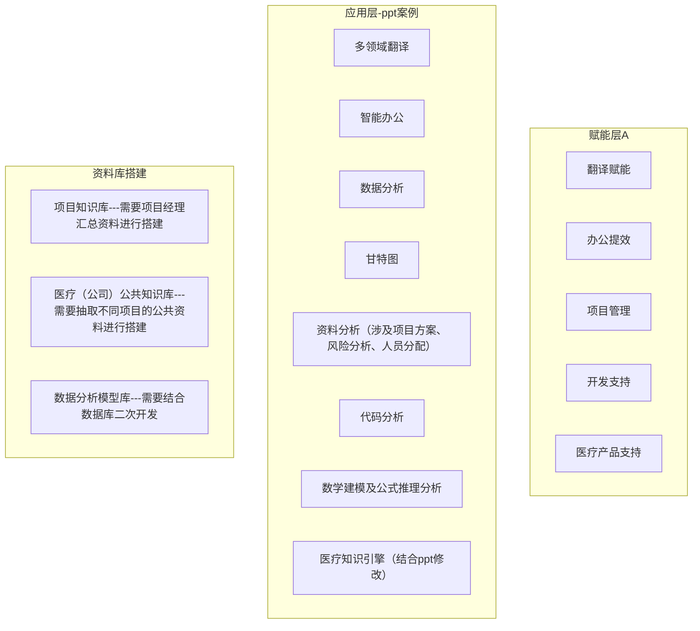

```mermaid
flowchart TB
  subgraph 赋能层A
    A1[翻译赋能]:::direction
    A2[办公提效]:::direction
    A3[项目管理]:::direction
    A4[开发支持]:::direction
    A5[医疗产品支持]:::direction
  end

subgraph 应用层-ppt案例
    B1[多领域翻译]:::ability
    B2[智能办公]:::ability
    B3[数据分析]:::ability
    B4[甘特图]:::ability
    B5[资料分析（涉及项目方案、风险分析、人员分配）]:::ability
    B6[代码分析]:::ability
    B8[数学建模及公式推理分析]:::ability
    B7[医疗知识引擎（结合ppt修改）]:::ability
end

subgraph 资料库搭建
    C1[项目知识库---需要项目经理汇总资料进行搭建]:::knowledge
    C2[医疗（公司）公共知识库---需要抽取不同项目的公共资料进行搭建]:::knowledge
    C3[数据分析模型库---需要结合数据库二次开发]:::knowledge
end

```