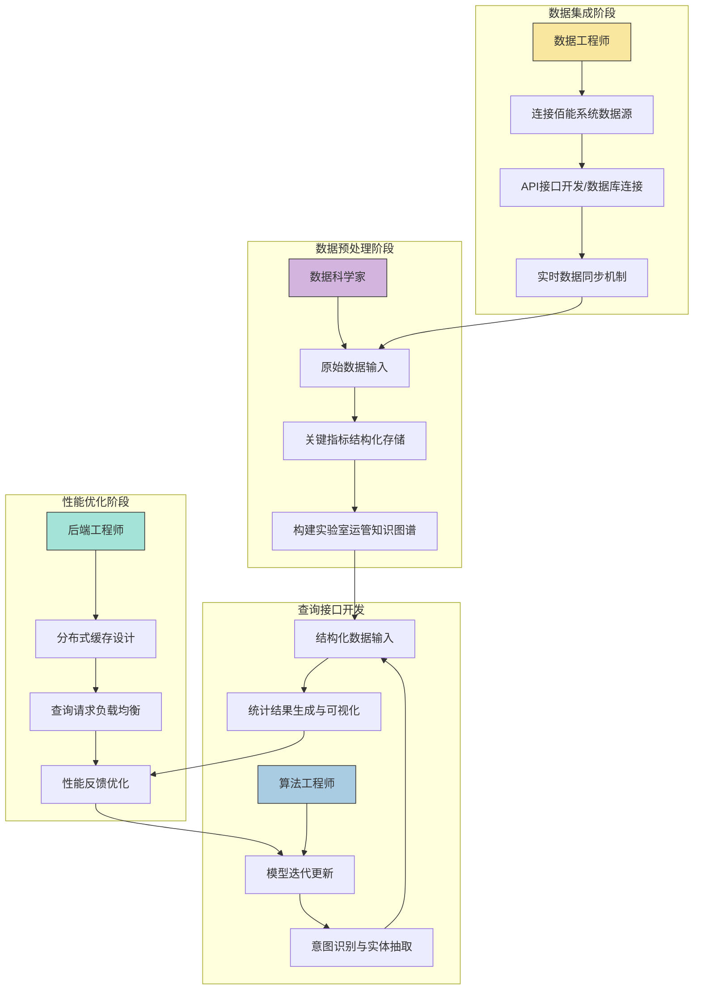

```mermaid
graph TD
    subgraph 数据集成阶段
        A1[数据工程师] --> A2[连接佰能系统数据源]
        A2 --> A3[API接口开发/数据库连接]
        A3 --> A4[实时数据同步机制]
    end

    subgraph 数据预处理阶段
        B1[数据科学家] --> B2[数据清洗与格式化]
        B2 --> B3[关键指标结构化存储]
        B3 --> B4[构建实验室运管知识图谱]
    end

    subgraph 查询接口开发
        C1[算法工程师] --> C2[自然语言理解模块开发]
        C2 --> C3[意图识别与实体抽取]
        C3 --> C4[知识库检索与数据匹配]
        C4 --> C5[统计结果生成与可视化]
    end

    subgraph 性能优化阶段
        D1[后端工程师] --> D2[分布式缓存设计]
        D2 --> D3[查询请求负载均衡]
        D3 --> D4[响应速度监控系统]
    end

    A4 --> B2[原始数据输入]
    B4 --> C4[结构化数据输入]
    C5 --> D4[性能反馈优化]
    D4 --> C2[模型迭代更新]

    style A1 fill:#F9E79F,stroke:#333
    style B1 fill:#D2B4DE,stroke:#333
    style C1 fill:#A9CCE3,stroke:#333
    style D1 fill:#A3E4D7,stroke:#333

```