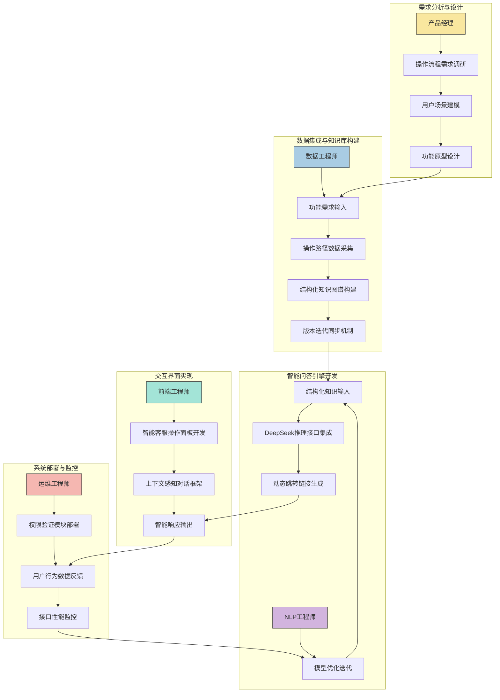

```mermaid
graph TD
    subgraph 需求分析与设计
        PM[产品经理] --> A1[操作流程需求调研]
        A1 --> A2[用户场景建模]
        A2 --> A3[功能原型设计]
    end

    subgraph 数据集成与知识库构建
        DE[数据工程师] --> B1[佰能系统API对接]
        B1 --> B2[操作路径数据采集]
        B2 --> B3[结构化知识图谱构建]
        B3 --> B4[版本迭代同步机制]
    end

    subgraph 智能问答引擎开发
        NLP[NLP工程师] --> C1[自然语言解析模型训练]
        C1 --> C2[操作意图分类器]
        C2 --> C3[DeepSeek推理接口集成]
        C3 --> C4[动态跳转链接生成]
    end

    subgraph 交互界面实现
        FE[前端工程师] --> D1[智能客服操作面板开发]
        D1 --> D2[上下文感知对话框架]
        D2 --> D3[一键跳转功能实现]
    end

    subgraph 系统部署与监控
        OPS[运维工程师] --> E1[权限验证模块部署]
        E1 --> E2[操作日志追踪系统]
        E2 --> E3[接口性能监控]
    end

    A3 --> B1[功能需求输入]
    B4 --> C2[结构化知识输入]
    C4 --> D3[智能响应输出]
    D3 --> E2[用户行为数据反馈]
    E3 --> C1[模型优化迭代]

    style PM fill:#F9E79F,stroke:#333
    style DE fill:#A9CCE3,stroke:#333
    style NLP fill:#D2B4DE,stroke:#333
    style FE fill:#A3E4D7,stroke:#333
    style OPS fill:#F5B7B1,stroke:#333

```